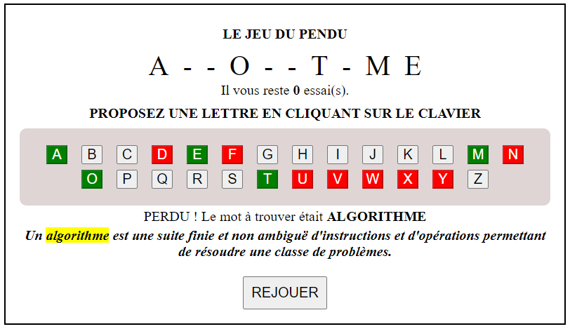

---

Author: Alain ORLUK  
Formation : Développeur Web & Web mobile  
Lieu: Marseille
Date : 27/10/2023  

---
# **EXERCICE**

En utilisant mon code, voici votre objectif :  


## **1 - Remplacer le tableau `ARRAY_MOTS`**

Remplacer `ARRAY_MOTS` par :  

```js
const ARRAY_DEFINITIONS = [
    {
        mot: "NAVIGATEUR",
        definition: "Un navigateur web est un logiciel conçu pour consulter et afficher le World Wide Web"
    },
    {
        mot: "RESPONSIVE",
        definition: "Un site web responsive ou 'réactif' est un site web dont la conception vise à offrir une consultation confortable sur des écrans de tailles très différentes"},
    {
        mot: "PACKAGE",
        definition: "En développement web, le terme package ou 'paquet' est le nom donné à une bibliothèque logicielle."},
    {
        mot: "PROJET",
        definition: "Techniquement, le terme projet est la concrétisation ou la réalisation d'une idée en mobilisant les ressources nécessaires dont on a besoin, en fixant et en respectant le délai de sa réalisation sans oublier la qualité de la finalité."},
    {
        mot: "REFERENCEMENT",
        definition: "Sur internet, le travail de référencement consiste à améliorer le positionnement et la visibilité de sites dans des pages de résultats de moteurs de recherche ou d'annuaires."},
    {
        mot: "ALGORITHME",
        definition: "Un algorithme est une suite finie et non ambiguë d'instructions et d\'opérations permettant de résoudre une classe de problèmes."},
    {
        mot: "FRAMEWORK",
        definition: "En développement web, un framework est un ensemble cohérent de composants structurels qui sert à créer l'architecture de tout ou partie d'une application"},
    {
        mot: "PROCEDURALE",
        definition: "En informatique, la programmation procédurale est un paradigme qui se fonde sur le concept d'appel procédural. Une procédure, aussi appelée routine, sous-routine ou fonction (à ne pas confondre avec les fonctions de la programmation fonctionnelle reposant sur des fonctions mathématiques), contient simplement une série d'étapes à réaliser. N\'importe quelle procédure peut être appelée à n'importe quelle étape de l\'exécution du programme, y compris à l\'intérieur d\'autres procédures, voire dans la procédure elle-même (récursivité)."},
    {
        mot: "APPLICATION",
        definition: "En informatique, une application web est une application manipulable directement en ligne grâce à un navigateur web et qui ne nécessite donc pas d'installation sur les machines clientes, contrairement aux applications mobiles."}
]
```

## **2 - Sélectionner un mot au hasard dans `ARRAY_DEFINITIONS` et le stocker dans `MOT_MYSTERE`**

## **3 - Définir le contenu HTML du second paragraph de la *div* ayant pour classe `resultat`**

Votre challenge est d'ajouter la définition appropriée (récupérée en accédant à la valeur de la propriété `definition` de l'objet adéquat du tableau `ARRAY_DEFINITIONS`) dans le second paragraphe de la ***div*** ayant la classe `resultat`.  
Je vous mets sur la piste :  

```js
    document.querySelector(".resultat p:last-of-type").??? = ???;
```

## **CONSIGNES**

- Lorsque vous avez `trouve()` une solution, appelez-moi pour me la soumettre.
- Ceux pour qui j'ai validé leur solution laissent leurs collègues `trouver()`. On ne leur souffle pas un `.mot`.
- Le texte en italique apparait que l'on ait gagné ou perdu.
- Utiliser les balises sémantiques `strong`, `em` et `mark`.
- Aucun besoin de structure `if` ou `for` pour cet exercice.
- Un ou plusieurs indices se sont glissés dans ces consignes.
- Aucune limite de temps. On a la journée 😁😁😁😁.
